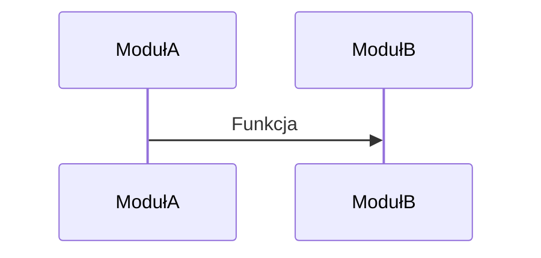

# budgetProject

Projekt ma na celu stworzenie prostej aplikacji do zarzadzania budzetem domowym

## Funkcjonalanosci 
* dodawanie kosztu/wplywu wg szablonu
    * tytul
    * komentarz
    * data
    * kwota
    * kategoria
* pobranie aktualnego stanu konta
* listowanie wydatkow/wplywow wg kryteriow:
    * kategoria
    * data
    * kwota
    * tytul (optional)
* dodanie nowej kategorii
* podsumowanie/bilans dla danego dnia/miesiaca/roku

## Moduly i ich zaleznosci

